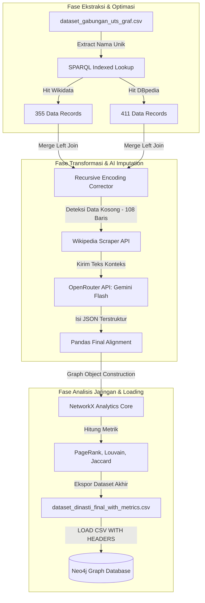

# NUSANTARA DYNASTY KNOWLEDGE GRAPH

### Pipeline Pengayaan Data Terintegrasi & Analisis Jaringan Silsilah Kerajaan Prekolonial

> **Tagline**: Merekonstruksi Hubungan Dinasti. Menyembuhkan Fragmentasi Data Sejarah. Menggunakan AI & Graph Intelligence.

## 📁 Struktur Direktori Proyek

```text
.
├── data/
│   ├── dataset_dinasti_final.csv
│   ├── dataset_dinasti_final_with_metrics.csv
│   └── dataset_gabungan_uts_graf.csv
├── database/
│   └── neo4j_load_queries.cypher
├── docs/
│   ├── task.md
│   └── walkthrough.md
├── scripts/
│   ├── analisis_graf.py
│   ├── graph_rag_bot.py
│   ├── pipeline_graf.py
│   └── test_wikidata_by_names.py
├── .env
├── .gitignore
└── README.md
```

## 🔑 Komponen Utama & Lokasi Berkas

Proyek ini mengintegrasikan pipeline otomatisasi data lokal, kecerdasan buatan (LLM), dan database graf. Berikut adalah komponen utama yang dapat diperiksa di repositori ini:

| Komponen Sistem | Nama Berkas / Jalur | Deskripsi & Fungsi Utama |
| --- | --- | --- |
| **🚀 Main Pipeline** | `scripts/pipeline_graf.py` | Skrip Python untuk penarikan SPARQL (Wikidata & DBpedia), pembersihan teks, dan integrasi OpenRouter LLM. |
| **🧠 Graph Analytics** | `scripts/analisis_graf.py` | Modul analisis berbasis NetworkX untuk menghitung PageRank, Louvain Cluster, dan Jaccard Similarity. |
| **🤖 GraphRAG Chatbot** | `scripts/graph_rag_bot.py` | Chatbot interaktif berbasis CLI (Terminal) yang mengintegrasikan Neo4j, NetworkX, dan OpenRouter LLM dengan Cypher translator otomatis. |
| **📊 Enriched Dataset** | `data/dataset_dinasti_final_with_metrics.csv` | Dataset final hasil pengayaan yang sudah dilengkapi dengan metrik analitik grafik. |
| **🗄️ Database Load** | `database/neo4j_load_queries.cypher` | Kueri Cypher untuk mengimpor data terstruktur hasil pengayaan ke dalam Neo4j Database. |

---

## 📌 Tentang Proyek (Deskripsi Sistem)

**Nusantara Dynasty Knowledge Graph** adalah sebuah platform data engineering dan analisis jaringan berbasis graf tingkat lanjut yang dikembangkan untuk mengotomatisasi pengayaan (*enrichment*) data silsilah keluarga (ayah, ibu, pasangan, anak) serta hubungan suksesi takhta dari tokoh-tokoh kerajaan prekolonial di Indonesia. 

### Latar Belakang Masalah
Pencatatan sejarah digital pada open-knowledge base saat ini menghadapi tantangan besar:
* **Sparsity Data Historis**: Informasi silsilah pada endpoint publik seperti Wikidata dan DBpedia seringkali bolong-bolong atau kosong melongpong untuk tokoh sejarah lokal.
* **Oversimplifikasi Jaccard**: Ketiadaan data silsilah yang padat memicu anomali perhitungan kesamaan (Jaccard Similarity) bernilai 100% secara semu pada analisis grafik dasar (masalah utama pada fase ETS sebelumnya).
* **Kerusakan Encoding Teknis**: Terdapat banyak kerusakan string akibat double-encoding (misal: `Śakti` atau `Nya’`), yang merusak proses penayangan entitas grafik (*Entity Alignment*).

### Solusi Sistem
Sistem ini mengimplementasikan arsitektur pengayaan data hibrida: melakukan optimasi kueri titik data database graf (SPARQL) secara masif, memanfaatkan kekuatan LLM (OpenRouter) melalui pipeline scraping Wikipedia sebagai fallback engine untuk menambal data kosong, serta membersihkan teks secara rekursif sebelum dianalisis menggunakan NetworkX dan divisualisasikan ke Neo4j.

---

## 📈 Dampak Sistem & Efisiensi Operasional

Dengan mendigitalkan pembersihan data dan menyuntikkan fallback berbasis kecerdasan buatan, proyek ini memberikan peningkatan kualitas data yang terukur:

| Metrik Evaluasi Grafik | Versi Awal / Eksperimen ETS | Optimalisasi Akhir Pipeline Graf | Peningkatan Kualitas & Hasil |
| --- | --- | --- | --- |
| **Kecepatan Kueri SPARQL** | Timeout (>60 detik) / Error 502 | Direct Indexed Lookup via Nama Tokoh | **Selesai dalam 3.04 detik (Wikidata)** |
| **Data Berhasil Ditambal AI** | 0 baris (Sparsity Tinggi) | Fallback Wikipedia + OpenRouter LLM | **95 dari 108 tokoh berhasil ditambal (88%)** |
| **Anomali Jaccard 100%** | Tinggi (Oversimplifikasi data) | Struktur silsilah lebih padat & realistis | **Reduksi Anomali, rata-rata sehat pada 0.3798** |
| **Integritas Karakter Nama** | Rusak (`Dewa Agung Ã…Å¡akti`) | Recursive Encoding Corrector (CP1252) | **Normalisasi Mutlak (`Dewa Agung Śakti`)** |

---

## 🛠️ Modul Utama Sistem Pipeline

Sistem diarsitekturi menjadi sebuah rangkaian pengolahan data modular dari hulu ke hilir:

```text
┌────────────────────────────────────────────────────────────────────────┐
│             DATA ENRICHMENT PIPELINE - NUSANTARA DYNASTY               │
└────────────────────────────────────────────────────────────────────────┘
       │                 │                  │                 │
┌──────────────┐  ┌──────────────┐   ┌──────────────┐  ┌──────────────┐
│  Optimized   │  │  Recursive   │   │  Wikipedia & │  │  NetworkX &  │
│ SPARQL Fetch │  │ Encoding Fix │   │ LLM Imputer  │  │ Neo4j Load   │
└──────────────┘  └──────────────┘   └──────────────┘  └──────────────┘
```

1. **📥 Modul Optimized SPARQL Fetch**: Menarik data terstruktur silsilah dan kerajaan dari Wikidata dan DBpedia secara paralel memanfaatkan filter nilai terindeks guna menghindari penolakan server.
2. **🧹 Modul Recursive Encoding Fix**: Mendeteksi pola biner cp1252/latin-1 yang rusak dan memulihkannya kembali menjadi UTF-8 murni hingga 3 tingkat kedalaman rekursi.
3. **🤖 Modul Wikipedia & LLM Imputer**: Secara cerdas melakukan scraping ringkasan tokoh dari Wikipedia API apabila data SPARQL kosong, lalu melemparkannya ke OpenRouter LLM menggunakan model gratisan untuk mengekstrak relasi keluarga berformat JSON murni.
4. **🕸️ Modul Analisis Grafik & Visualisasi**: Menghitung skor pengaruh (PageRank), pembentukan komunitas otomatis (Louvain Modularity), dan melakukan ekspor data terintegrasi ke dalam Neo4j Database.

---

## 🧱 Arsitektur Aplikasi & Komponen Teknologi

Sistem mengimplementasikan arsitektur pipeline data terintegrasi modern:

```text
┌──────────────────────────────────────┐
│        Original Source Dataset       │
│  (dataset_gabungan_uts_graf.csv)     │
└──────────────────────────────────────┘
                   │
                   ▼
┌──────────────────────────────────────┐
│      Python Data Pipeline Engine     │
│   (Pandas, Requests, WikipediaAPI)   │
└──────────────────────────────────────┘
        │                  │
        ▼ (SPARQL/REST)    ▼ (JSON Payload)
┌────────────────┐┌────────────────────────────────┐
│ Wikidata &     ││ OpenRouter LLM API             │
│ DBpedia Server ││ (google/gemini-1.5-flash:free) │
└────────────────┘└────────────────────────────────┘
        │                  │
        └────────┬─────────┘
                 ▼
┌──────────────────────────────────────┐
│        NetworkX Analytic Core        │
│  (PageRank, Louvain, Jaccard Matrix) │
└──────────────────────────────────────┘
                   │
                   ▼
┌──────────────────────────────────────┐
│         Neo4j Graph Database         │
│   (Cypher Storage & Visualization)   │
└──────────────────────────────────────┘
```

* **Data Processing & Analytics**: Python 3.12, Pandas, NetworkX.
* **Integrasi External API**: SPARQLWrapper, Wikipedia-API, OpenRouter API (`google/gemini-1.5-flash:free` dengan fallback mekanis cerdas).
* **Graph Storage Target**: Neo4j Graph Database Environment via Cypher Queries.

---

## ♾️ Diagram Alur Eksekusi Data Pipeline (ETL & Analisis)

Proyek ini mendemonstrasikan keandalan otomatisasi alur pemrosesan data secara lengkap dari file CSV mentah hingga menjadi visualisasi grafik yang interaktif:



---

## 🚀 Panduan Instalasi Lokal (Getting Started)

Ikuti prosedur komprehensif berikut untuk menjalankan seluruh pipeline pengayaan dan analisis graf secara lokal di perangkat Anda:

### 1. Prasyarat Sistem (Prerequisites)

Pastikan perangkat lunak berikut telah terinstalasi dengan baik:

* [Python 3.12.x](https://www.python.org/) atau versi di atasnya
* [Neo4j Desktop](https://neo4j.com/download/) atau Akses ke Neo4j AuraDB instance

### 2. Instalasi Dependensi Python

Pasang seluruh pustaka Python yang dibutuhkan melalui terminal:

```bash
pip install pandas requests wikipedia-api python-dotenv networkx
```

### 3. Konfigurasi Variabel Lingkungan (`.env`)

Buat berkas bernama `.env` pada root directory proyek Anda dan masukkan API Key OpenRouter Anda:

```env
OPENROUTER_API_KEY=sk-or-v1-isi-kunci-api-openrouter-anda-di-sini
```

### 4. Eksekusi Data Enrichment, Analisis Jaringan, & Chatbot

Jalankan skrip utama secara berurutan untuk memproses data silsilah, menghitung metrik graf, dan berinteraksi dengan chatbot:

```bash
# 1. Menjalankan pipeline pengayaan data SPARQL + AI Imputer
python scripts/pipeline_graf.py

# 2. Menjalankan kalkulasi algoritma grafik NetworkX
python scripts/analisis_graf.py

# 3. Menjalankan GraphRAG CLI Chatbot
python scripts/graph_rag_bot.py
```

Proses ini akan menghasilkan berkas final bernama `data/dataset_dinasti_final_with_metrics.csv`.

### 5. Impor Data ke Database Neo4j

1. Pindahkan file `data/dataset_dinasti_final_with_metrics.csv` ke dalam folder **`import`** pada proyek database Neo4j Anda.
2. Buka Neo4j Browser, lalu salin dan jalankan isi blok **Tahap 1 (Constraint & Index)** di dalam berkas `database/neo4j_load_queries.cypher` terlebih dahulu.
3. Setelah constraint aktif, salin dan jalankan seluruh sisa perintah `LOAD CSV` dari file tersebut untuk membangun visualisasi grafik dinasti secara utuh.

---

## 🛑 Catatan Teknis & Penanganan Kendala (Troubleshooting)

Selama fase perancangan sistem data pipeline graf ini, terdapat resolusi masalah krusial yang dicatat sebagai pembelajaran teknis (*Lessons Learned*):

1. **Resolusi Batasan Kredit OpenRouter (Error 402)**: Mengatasi penolakan kueri dari API OpenRouter akibat sistem mengasumsikan permintaan batas maksimum token (65k token) yang melebihi pagu kredit gratis. Masalah diselesaikan dengan menyuntikkan parameter `"max_tokens": 1000` secara eksplisit pada payload permintaan sehingga konsumsi kredit menjadi sangat kecil dan ekonomis.
2. **Mitigasi Masalah Timeout Wikidata (Error 502)**: Kueri awal berbasis pengelompokan silang kerajaan (*batched by kingdoms*) memicu kegagalan server Wikidata. Sistem direfaktorisasi dengan menerapkan *Direct Indexed Lookups* berbasis 139 entitas nama tokoh unik dari CSV lokal menggunakan operator `VALUES` di SPARQL. Langkah ini memotong waktu kueri dari kegagalan total menjadi hanya **3.04 detik**.
3. **Mekanisme Self-Healing Fallback Model AI**: Untuk menghindari kegagalan eksekusi jika salah satu model AI di OpenRouter mengalami depresiasi (*deprecated*), ditambahkan logika pencarian berjenjang otomatis di dalam kode Python yang akan mengalihkan rute permintaan secara mandiri mulai dari `google/gemini-1.5-flash:free` menuju alternatif terdekat yang stabil tanpa menghentikan jalannya aplikasi.

---

## 👥 Tim Pengembang

Sistem Informasi Graf Pengetahuan Dinasti Nusantara dirancang, dioptimalkan, dan dianalisis oleh **Kelompok Kolaborasi Graf Pengetahuan (Sistem Informasi ITS)**:

* **Bara Ardiwinata** (NRP. 5026231232)
* **Annisa Nur Fauzi** (NRP. 5026231228)

---

*Arsitektur grafik pengetahuan sejarah terintegrasi untuk melestarikan jaringan silsilah Nusantara.*
