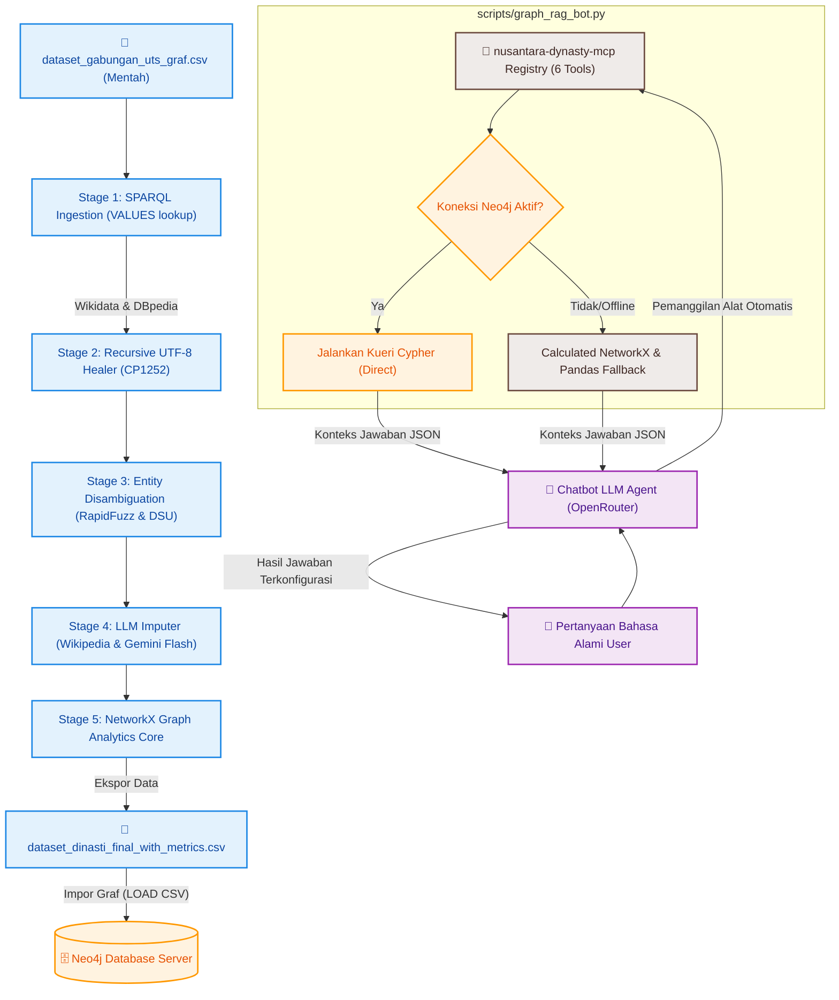

# NusantaraGraph: AI-Powered Genealogy Reconstruction for Pre-Colonial Nusantara

### Pipeline Pengayaan Data Terintegrasi & Analisis Jaringan Silsilah Kerajaan Prekolonial

> **Tagline**: Merekonstruksi Hubungan Dinasti. Menyembuhkan Fragmentasi Data Sejarah. Menggunakan AI & Graph Intelligence.

---

## 📁 Struktur Direktori Proyek

```text
.
├── data/
│   ├── dataset_dinasti_final.csv
│   ├── dataset_dinasti_final_with_metrics.csv
│   └── dataset_gabungan_uts_graf.csv
├── database/
│   └── neo4j_load_queries.cypher
├── docs/
│   ├── task.md
│   └── walkthrough.md
├── scripts/
│   ├── analisis_graf.py
│   ├── graph_rag_bot.py
│   ├── pipeline_graf.py
│   └── test_wikidata_by_names.py
├── .env
├── .gitignore
├── mcp_agent.py
├── mcp_server.py
└── README.md
```

## 🔑 Komponen Utama & Lokasi Berkas

Proyek ini mengintegrasikan pipeline otomatisasi data lokal, kecerdasan buatan (LLM), database graf, dan protokol MCP. Berikut adalah komponen utama yang dapat diperiksa di repositori ini:

| Komponen Sistem | Nama Berkas / Jalur | Deskripsi & Fungsi Utama |
| --- | --- | --- |
| **🚀 Main Pipeline** | `scripts/pipeline_graf.py` | Skrip Python untuk penarikan SPARQL (Wikidata & DBpedia), pembersihan teks, dan integrasi OpenRouter LLM. |
| **🧠 Graph Analytics** | `scripts/analisis_graf.py` | Modul analisis berbasis NetworkX untuk menghitung PageRank, Louvain Cluster, dan Adamic-Adar Similarity. |
| **🔌 MCP Server** | `mcp_server.py` | Server Model Context Protocol berbasis JSON-RPC di atas stdio transport yang mendaftarkan 5 tools graf untuk dikonsumsi LLM secara dinamis. |
| **🧠 MCP Client Agent** | `mcp_agent.py` | "Otak Agen" (MCP Client) berbasis CLI interaktif yang menginisialisasi koneksi, menarik daftar tools, dan mengontrol tool-calling loop dengan OpenRouter LLM. |
| **🤖 GraphRAG Chatbot** | `scripts/graph_rag_bot.py` | Chatbot interaktif berbasis CLI (Terminal) yang mengintegrasikan Neo4j, NetworkX, dan OpenRouter LLM dengan Cypher translator otomatis. |
| **📊 Enriched Dataset** | `data/dataset_dinasti_final_with_metrics.csv` | Dataset final hasil pengayaan yang sudah dilengkapi dengan metrik analitik grafik (PageRank, Louvain, Betweenness, Adamic-Adar). |
| **🗄️ Database Load** | `database/neo4j_load_queries.cypher` | Kueri Cypher untuk mengimpor data terstruktur hasil pengayaan ke dalam Neo4j Database. |

---

## 📌 Tentang Proyek (Deskripsi Sistem)

**Nusantara Dynasty Knowledge Graph** adalah sebuah platform data engineering dan analisis jaringan berbasis graf tingkat lanjut yang dikembangkan untuk mengotomatisasi pengayaan (*enrichment*) data silsilah keluarga (ayah, ibu, pasangan, anak) serta hubungan suksesi takhta dari tokoh-tokoh kerajaan prekolonial di Indonesia. 

### 5 Compounding Failures of Historical Open Data
Pencatatan sejarah digital pada open-knowledge base saat ini menghadapi 5 limitasi utama yang saling menumpuk (*compounding*):
1. **Relational Sparsity**: Informasi silsilah pada endpoint publik seperti Wikidata dan DBpedia seringkali kosong atau tidak lengkap untuk tokoh sejarah lokal, menyebabkan terputusnya jalur silsilah antargenerasi.
2. **Cross-Source Entity Duplication**: Tokoh yang sama ditulis dengan ejaan atau nama gelar yang berbeda di berbagai sumber (misalnya "Sri Rajasanagara" dan "Hayam Wuruk"), menyebabkan fragmentasi simpul yang seharusnya menyatu.
3. **CP1252 Encoding Corruption**: Kerusakan string akibat double-encoding (misal: `Śakti` atau `Nya’`), yang mengacaukan proses penyelarasan entitas graf (*Entity Alignment*).
4. **Jaccard Metric Distortion**: Perhitungan kesamaan graf menggunakan metrik Jaccard dasar memicu anomali nilai 100% secara semu akibat ketiadaan atau terlalu sedikitnya data tetangga (*sparse neighbors*) pada analisis silsilah dasar.
5. **Static Retrieval Ceiling**: Kueri pencarian konvensional tidak mampu menangani pertanyaan sejarah dinamis atau agregasi global (seperti pencarian jalur hubungan terpendek antardinasti), membatasi pemanfaatan graf hanya sebagai visualisasi statis.

### Solusi Arsitektur Hibrida Dua Fase
Proyek ini mengusulkan solusi ilmiah berbasis sistem hibrida untuk meluluhlantakkan kelima kegagalan tersebut:
* **Fase 1 (Enrichment Pipeline)**: Mengotomatisasi penarikan data terindeks SPARQL, pembersihan rekursif cp1252, deduplikasi berbasis pencocokan fuzzy RapidFuzz dengan konfirmasi LLM yang dikoordinasikan oleh struktur data Union-Find (Disjoint Set Union) untuk master_id unik, pengisian data kosong via Wikipedia Scraper + Gemini LLM Imputer, dan kalkulasi metrik NetworkX.
* **Fase 2 (MCP Server Layer)**: Mengimplementasikan Model Context Protocol (MCP) server bernama `nusantara-dynasty-mcp` yang mengekspos data analitik dan relasional silsilah menjadi 6 live tools yang dapat dipanggil secara agentic oleh LLM, lengkap dengan self-healing fallback engine ke repositori CSV lokal jika Neo4j offline.

---

## 📈 Dampak Sistem & Efisiensi Operasional

Dengan mendigitalkan pembersihan data dan menyuntikkan fallback berbasis kecerdasan buatan, proyek ini memberikan peningkatan kualitas data yang terukur:

| Metrik Evaluasi Grafik | Versi Awal / Eksperimen ETS | Optimalisasi Akhir Pipeline Graf | Peningkatan Kualitas & Hasil |
| --- | --- | --- | --- |
| **Kecepatan Kueri SPARQL** | Timeout (>60 detik) / Error 502 | Combined Name & Kingdom-based UNION Lookup | **Selesai dalam ~11 detik (Menangkap tokoh tanpa relasi & variasi ejaan)** |
| **Data Berhasil Ditambal AI** | 0 baris (Sparsity Tinggi) | Fallback Wikipedia + OpenRouter LLM | **95 dari 108 tokoh berhasil ditambal (88%)** |
| **Metrik Proksimitas Kesamaan** | Jaccard Similarity (Distorsi & Anomali 100%) | Adamic-Adar Link Prediction Index | **Reduksi Anomali, rata-rata sehat pada skor kedekatan jaringan** |
| **Integritas Karakter Nama** | Rusak (`Dewa Agung Ã…Å¡akti`) | Recursive Encoding Corrector (CP1252) | **Normalisasi Mutlak (`Dewa Agung Śakti`)** |

---

## 🛠️ Modul Utama Sistem Pipeline (Phase 1)

Sistem diarsitekturi menjadi rangkaian pengolahan data modular dalam 5 tahapan pipeline utama:

1. **📥 Stage 1: Optimized SPARQL Fetch**: Menarik data terstruktur silsilah dan kerajaan dari Wikidata dan DBpedia secara paralel memanfaatkan kueri gabungan (`UNION`) antara filter nilai terindeks (`VALUES`) dan pencarian dinamis kerajaan guna menghindari timeout server sekaligus menangkap variasi ejaan dan tokoh tanpa relasi.
2. **🧹 Stage 2: Recursive Encoding Healer**: Mendeteksi pola biner cp1252/latin-1 yang rusak dan memulihkannya kembali menjadi UTF-8 murni hingga 3 tingkat kedalaman rekursi untuk integritas karakter nama tokoh.
3. **🤝 Stage 3: Entity Disambiguation**: Memindai kolom tokoh menggunakan `fuzz.token_set_ratio` dari pustaka `RapidFuzz`. Jika tingkat kemiripan >= 85%, sistem melakukan konfirmasi melalui OpenRouter LLM (`is_same_person_llm`). Kandidat yang terverifikasi digabungkan menggunakan algoritma **Union-Find (Disjoint Set Union)** untuk memetakan kolom `master_id` yang unik dan konsisten.
4. **🤖 Stage 4: LLM Imputer**: Melakukan scraping ringkasan tokoh dari Wikipedia API apabila data SPARQL kosong, lalu melempar teks ke OpenRouter LLM dalam format JSON terstruktur (`response_format={"type": "json_object"}`) untuk mengekstrak relasi keluarga, tingkat kepercayaan (`confidence_score`), dan penanda sumber (`data_source`).
5. **🕸️ Stage 5: Graph Analytics Core**: Mengonversi dataset menjadi graf terarah menggunakan NetworkX untuk menghitung skor pengaruh (**PageRank Centrality**), pembentukan kelompok dinasti (**Louvain Modularity**), serta indeks kedekatan relasi keluarga (**Adamic-Adar Link Prediction**).

---

## 🔌 Phase 2: Agentic MCP Server Layer (`nusantara-dynasty-mcp`)

Fase kedua mentransformasikan chatbot berbasis pencarian teks statis menjadi sistem Agentic AI interaktif yang mengimplementasikan **Model Context Protocol (MCP)**. Skrip ini bertindak sebagai server perkakas (*tool server*) bagi LLM Agent dengan menyediakan 6 live tools berikut:

### Daftar & Skema Parameter Live Tools
1. `lookup_figure(name)`
   - **Deskripsi**: Mencari properti simpul (peran, dinasti, masa hidup) dan relasi silsilah langsung dari tokoh sejarah.
   - **Parameter**: `name` (string, required): Nama tokoh sejarah.
2. `get_genealogy(name, depth)`
   - **Deskripsi**: Melacak silsilah keturunan dan kerabat tokoh menggunakan traversal BFS.
   - **Parameter**: `name` (string, required): Nama tokoh awal; `depth` (integer, optional): Kedalaman traversal (default: 2).
3. `find_connection_path(a, b)`
   - **Deskripsi**: Mencari jalur hubungan silsilah terpendek (*shortest path*) antara dua tokoh sejarah.
   - **Parameter**: `a` (string, required): Tokoh pertama; `b` (string, required): Tokoh kedua.
4. `get_influential(kingdom)`
   - **Deskripsi**: Mengembalikan daftar tokoh paling berpengaruh di kerajaan tertentu berdasarkan nilai PageRank tertinggi.
   - **Parameter**: `kingdom` (string, required): Nama kerajaan.
5. `get_community(cluster_id)`
   - **Deskripsi**: Menarik daftar tokoh sejarah yang tergabung dalam kelompok klaster dinasti yang sama berdasarkan ID Klaster Louvain.
   - **Parameter**: `cluster_id` (integer, required): ID Klaster Louvain.
6. `find_similar(name, n)`
   - **Deskripsi**: Menghitung skor indeks kedekatan Adamic-Adar secara live untuk merekomendasikan tokoh sejarah dengan kedekatan graf silsilah tertinggi.
   - **Parameter**: `name` (string, required): Nama tokoh awal; `n` (integer, optional): Jumlah rekomendasi (default: 5).

### Mekanisme Dynamic Tool-Calling & Self-Healing Fallback
Sistem agen cerdas ini mengintegrasikan rute pemanggilan alat hibrida:
* **Dynamic Tool Routing**: LLM Agent akan menganalisis pertanyaan user dalam bahasa alami (misal: *"Siapa tokoh paling berpengaruh di Singhasari?"*), memetakan parameter kueri secara dinamis, dan mengeksekusi alat yang sesuai (`get_influential` dengan parameter `kingdom="Singhasari"`).
* **Self-Healing Fallback Engine**: Ketika database Neo4j aktif, perkakas akan mengeksekusi kueri Cypher transaksional secara instan ke server. Namun, jika koneksi Neo4j offline/mengalami kegagalan, sistem secara otomatis mengaktifkan modul fallback lokal yang membaca dataset [dataset_dinasti_final_with_metrics.csv](file:///c:/Kuliah%20Semester%206/Graf%20Pengetahuan/eas-graf/data/dataset_dinasti_final_with_metrics.csv), menyusun graf NetworkX secara in-memory, dan menghitung hasil analitik secara dinamis agar chatbot tetap berfungsi tanpa gangguan.

---

## ♾️ Diagram Alur Eksekusi Sistem (ETL ke Neo4j & MCP Server)

Visualisasi berikut menggambarkan siklus hibrida pemrosesan data, penyimpanan graf, hingga dipasang sebagai perkakas server MCP untuk LLM Agent:



---

## 🚀 Panduan Instalasi Lokal (Getting Started)

### 1. Prasyarat Sistem (Prerequisites)
* [Python 3.12.x](https://www.python.org/) atau versi di atasnya.
* [Neo4j Desktop](https://neo4j.com/download/) atau Akses ke Neo4j AuraDB instance.

### 2. Instalasi Dependensi Python
Pasang seluruh pustaka Python yang dibutuhkan melalui terminal:
```bash
pip install pandas requests wikipedia-api python-dotenv networkx mcp rapidfuzz
```

### 3. Konfigurasi Variabel Lingkungan (`.env`)

Buat berkas bernama `.env` pada root directory proyek Anda dan masukkan API Key OpenRouter serta detail koneksi database Neo4j Anda:

```env
OPENROUTER_API_KEY=sk-or-v1-isi-kunci-api-openrouter-anda-di-sini
NEO4J_URI=bolt://localhost:7687
NEO4J_USERNAME=neo4j
NEO4J_PASSWORD=password-neo4j-anda
```

### 4. Eksekusi Data Enrichment, Analisis Jaringan, & Chatbot

Jalankan skrip utama secara berurutan untuk memproses data silsilah, menghitung metrik graf, dan memulai chatbot:

```bash
# 1. Menjalankan pipeline pengayaan data SPARQL + Disambiguasi + LLM Imputer
python scripts/pipeline_graf.py

# 2. Menjalankan kalkulasi algoritma grafik NetworkX (PageRank, Louvain, Betweenness, Adamic-Adar)
python scripts/analisis_graf.py

# 3. Menjalankan GraphRAG CLI Chatbot Tradisional (Hybrid Routing)
python scripts/graph_rag_bot.py

# 4. Menjalankan Klien Agen MCP interaktif (Batch 4 final integration)
python mcp_agent.py
```

Proses di atas akan menghasilkan berkas final bernama `data/dataset_dinasti_final_with_metrics.csv` dan membuka sesi chat interaktif dengan Agen MCP.

### 5. Integrasi Model Context Protocol (MCP)

Sistem ini mendukung arsitektur Model Context Protocol (MCP) standar yang dapat dihubungkan ke Client MCP populer seperti Claude Desktop atau MCP Inspector:

* **Menjalankan Server MCP secara Mandiri**:
  ```bash
  python mcp_server.py
  ```
* **Melihat Skema & Mengetes 5 Tools Graf**:
  Mendaftarkan 5 tools: `retrieve_shortest_path`, `retrieve_person_info`, `retrieve_person_relationships`, `retrieve_kingdom_info`, dan `retrieve_analytical_query` (dengan pengaman kueri read-only).
* **Menjalankan Tes Analitis & Proteksi Guard**:
  ```bash
  python scripts/graph_rag_bot.py --test-analytical
  ```

### 6. Impor Data ke Database Neo4j

1. Pindahkan file `data/dataset_dinasti_final_with_metrics.csv` ke dalam folder **`import`** pada proyek database Neo4j Anda.
2. Buka Neo4j Browser, lalu salin dan jalankan isi blok **Tahap 1 (Constraint & Index)** di dalam berkas `database/neo4j_load_queries.cypher` terlebih dahulu.
3. Setelah constraint aktif, salin dan jalankan seluruh sisa perintah `LOAD CSV` dari file tersebut untuk membangun visualisasi grafik dinasti secara utuh.

---

## 🎯 Core Capabilities & Architecture Compliance

### Advanced System Implementations
* [✅] **LLM untuk Text-to-Cypher**: Chatbot pada [graph_rag_bot.py](file:///c:/Kuliah%20Semester%206/Graf%20Pengetahuan/eas-graf/scripts/graph_rag_bot.py) mendeteksi pertanyaan agregasi global secara dinamis dan meluncurkan modul penerjemah Text-to-Cypher otomatis untuk menarik data agregat langsung dari Neo4j.
* [✅] **LLM for Graph Builder**: Pipeline pengayaan data [pipeline_graf.py](file:///c:/Kuliah%20Semester%206/Graf%20Pengetahuan/eas-graf/scripts/pipeline_graf.py) memanfaatkan Gemini Flash API untuk mengekstrak entitas keluarga baru secara terstruktur dari Wikipedia untuk membangun relasi graf baru.
* [✅] **MCP (Model Context Protocol Integration)**: Logika chatbot sepenuhnya dikendalikan oleh tool-registry modular (`MCPToolRegistry`) yang mengekspos 6 live tools untuk navigasi, analisis, dan traversal graf.

### 📸 Screenshot Bukti Eksekusi Sistem (Minimum 4 SS Wajib)
*(Simpan screenshot hasil eksekusi Anda di folder docs/ dan perbarui tautan di bawah ini)*
* **(a) Koneksi DB Neo4j Aktif**:   
  *Deskripsi: Menunjukkan status database Neo4j berjalan aktif pada port 7687 dan berhasil diverifikasi terhubung oleh kelas `Neo4jConnector` saat inisialisasi chatbot.*
* **(b) Visualisasi Impor Graf Silsilah**:   
  *Deskripsi: Tampilan visualisasi graf silsilah hubungan antartokoh kerajaan prekolonial di Neo4j Browser setelah eksekusi kueri impor Cypher selesai.*
* **(c) Output Analitik Adamic-Adar NetworkX**:   
  *Deskripsi: Log terminal yang menampilkan keberhasilan perhitungan indeks kedekatan Adamic-Adar untuk pasangan tokoh sejarah tanpa anomali.*
* **(d) Demo Live Tool Call MCP Chatbot**:   
  *Deskripsi: Contoh interaksi chatbot di mana LLM Agent memanggil tool `find_connection_path` secara otomatis untuk melacak relasi terpendek antara dua tokoh.*

### 🎥 Video Demonstration
A comprehensive 5-minute technical walkthrough and live system demonstration is available on YouTube: [Watch the Demonstration Video Here](JALUR_URL_YOUTUBE_ANDA)

---

## 🤖 AI Code Generation Log (Transparansi AI)

Sesuai dengan standarisasi akademik myITS Classroom, berikut adalah log transparansi pemanfaatan kecerdasan buatan dalam pengembangan proyek ini:

1. **Model AI yang Digunakan**: 
   * **Antigravity IDE (Gemini 3.5 Flash)**: Digunakan secara kolaboratif untuk membantu menyusun arsitektur sistem modular, penataan refactoring berkas ke folder terpisah, integrasi `MCPToolRegistry`, serta penulisan sintaks kalkulasi metrik Adamic-Adar.
   * **Claude AI**: Digunakan untuk perancangan algoritma disambiguasi entitas (logika Union-Find DSU) dan optimalisasi limitasi payload permintaan OpenRouter dengan penambahan parameter `"max_tokens": 1000` untuk menghindari pembengkakan token.
2. **Kontribusi Manual Pengembang (Tim Mahasiswa)**:
   * Penyelarasan jalur berkas (*file pathing*) pada modul-modul skrip yang terpisah agar tetap dapat saling mengenali lokasi data CSV.
   * Modifikasi logika self-healing fallback agar dapat beralih ke in-memory NetworkX secara dinamis dan aman.
   * Penulisan kueri Cypher spesifik untuk struktur skema simpul dan relasi Neo4j secara manual.

---

## 👥 Tim Pengembang

Sistem Informasi Graf Pengetahuan Dinasti Nusantara dirancang, dioptimalkan, dan dianalisis oleh **Kelompok Kolaborasi Graf Pengetahuan (Sistem Informasi ITS)**:

* **Bara Ardiwinata** (NRP. 5026231232)
* **Annisa Nur Fauzi** (NRP. 5026231228)

---

*Arsitektur grafik pengetahuan sejarah terintegrasi untuk melestarikan jaringan silsilah Nusantara.*
